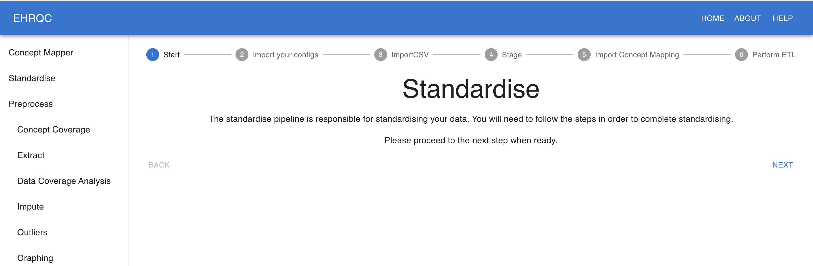
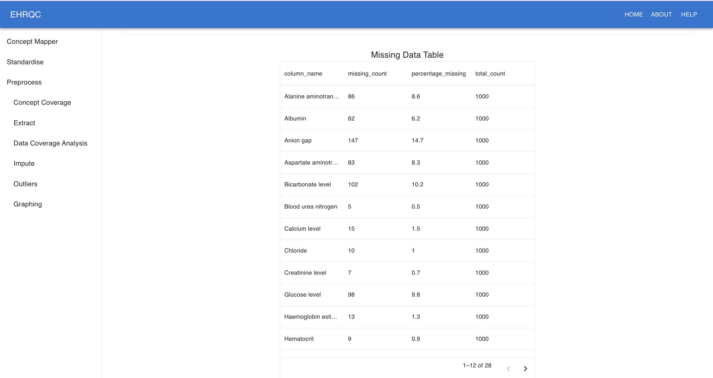
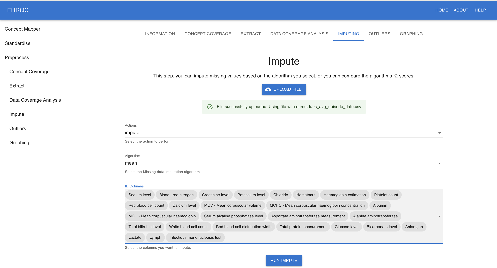
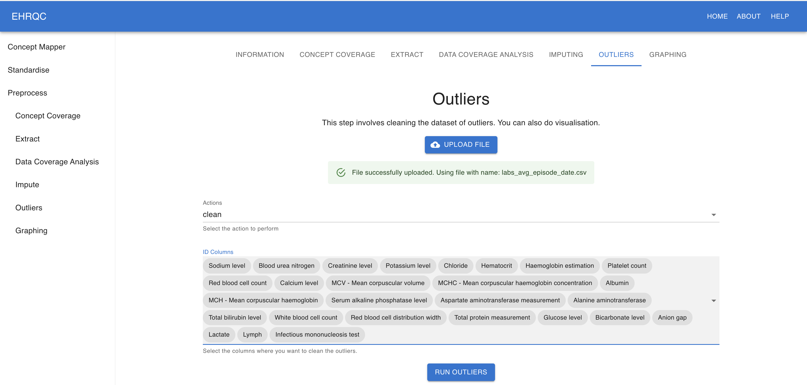
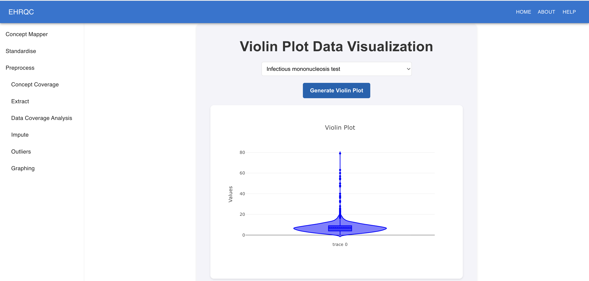

Case Study
==========

This update introduces several key capabilities, including reliable automated concept mapping, an user-friendly interface for standardisation, and real-time synchronisation of Electronic Health Record (EHR) data with FHIR. To demonstrate these features, we conducted a case study using a subset of publicly available EHR data, following the steps outlined below.

The dataset comprises 193,541 hourly observation records collected from 989 patients across 1000 hospital episodes.

Concept Mapping
+++++++++++++++

Using ontomapllm, clinical concepts were mapped to the SNOMED vocabulary. These mappings were then used in the subsequent standardisation process.

Some of the top matches are shown below;

+------------+----------------------------------------+--------------+--------------------------------+------------------+--------+-----------------+-------------------------------+
| Input_Code | Input_Label                            | Matched_Code | Matched_Label                  | Similarity_Score | Mapped | Decision_Source | Reason                        |
+============+========================================+==============+================================+==================+========+=================+===============================+
| 1067       | peripheral vascular disease            | 321052       | Peripheral vascular disease    | 1.0000           | 1      | threshold       | top_candidate_above_threshold |
+------------+----------------------------------------+--------------+--------------------------------+------------------+--------+-----------------+-------------------------------+
| 1068       | venous thromboembolic disease          | 4327889      | Thromboembolism of vein        | 0.7780           | 1      | llm             | llm_accepted_candidate        |
+------------+----------------------------------------+--------------+--------------------------------+------------------+--------+-----------------+-------------------------------+
| 1072       | essential hypertension                 | 320128       | Essential hypertension         | 1.0000           | 1      | threshold       | top_candidate_above_threshold |
+------------+----------------------------------------+--------------+--------------------------------+------------------+--------+-----------------+-------------------------------+
| 1073       | gestational hypertension/pre-eclampsia | 4167493      | Pregnancy-induced hypertension | 0.6378           | 1      | llm             | llm_accepted_candidate        |
+------------+----------------------------------------+--------------+--------------------------------+------------------+--------+-----------------+-------------------------------+
| 1075       | heart attack/myocardial infarction     | 4329847      | Myocardial infarction          | 0.6284           | 1      | llm             | llm_accepted_candidate        |
+------------+----------------------------------------+--------------+--------------------------------+------------------+--------+-----------------+-------------------------------+
| 1077       | heart arrhythmia                       | 44784217     | Cardiac arrhythmia             | 0.9819           | 1      | threshold       | top_candidate_above_threshold |
+------------+----------------------------------------+--------------+--------------------------------+------------------+--------+-----------------+-------------------------------+
| 1079       | cardiomyopathy                         | 321319       | Cardiomyopathy                 | 1.0000           | 1      | threshold       | top_candidate_above_threshold |
+------------+----------------------------------------+--------------+--------------------------------+------------------+--------+-----------------+-------------------------------+

Data Standardisation
++++++++++++++++++++

The dataset was standardised to the OMOP Common Data Model (OMOP-CDM) using the EHR-QC standardisation module, leveraging the mapped SNOMED concepts.

   Figure 1: Data Standardisation

Data Extraction and Quality Assessment
++++++++++++++++++++++++++++++++++++++

Standardised entities were extracted from the OMOP-CDM. A missing data report was then generated through the EHR-QC-Web portal to assess data completeness.

   Figure 2: Missingness Report

Missing Data Handling
+++++++++++++++++++++

Missing values were handled using the imputation functionality available within the EHR-QC-Web platform.

   Figure 3: Impute Missing Data

Outlier Analysis
++++++++++++++++

Outliers in the dataset were identified and removed to ensure data quality and consistency.

   Figure 4: Remove Outliers

Data Exploration
++++++++++++++++

At each stage, the web utility can be used to generate a range of plots for visualising the distribution of data attributes.

   Figure 5: Data Distribution Plots

FHIR Conversion and Ingestion
+++++++++++++++++++++++++++++

Finally, the processed dataset was converted to FHIR format and ingested into a locally deployed FHIR server using a FHIR–OMOP interconversion utility.

